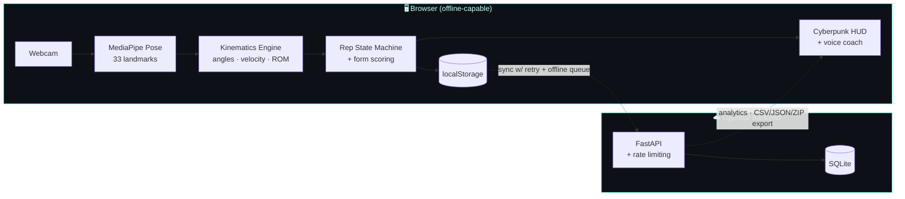

<div align="center">

# 🏋️ AI Fitness Trainer

### Real-time AI workout coach that runs **entirely in your browser**

Webcam → 33-point pose skeleton → biomechanics engine → live rep counting, form scoring & voice coaching. No installs, no uploads, no GPU required.

[](https://github.com/saurabhshreni-cmyk/ai-fitness-trainer/actions/workflows/ci.yml)
[](LICENSE)


[**Live Demo**](#-live-demo) · [**Features**](#-features) · [**Architecture**](#-architecture) · [**Quick Start**](#-quick-start) · [**API**](#-api-reference)

</div>

---

## 🎬 Live Demo

> **Frontend (Vercel):** `https://ai-fitness-trainer.vercel.app` — _replace with your URL after the one-click connect below_
>
> **Backend (Render):** optional — the app is fully functional offline (localStorage-first). The backend only adds cross-device sync, analytics, and exports.

[](https://vercel.com/new/clone?repository-url=https://github.com/saurabhshreni-cmyk/ai-fitness-trainer&root-directory=frontend-react)

> ⚠️ Webcam access requires HTTPS — works on Vercel out of the box, and on `localhost` for development.

---

## ✨ Features

| | |
|---|---|
| 🤖 **MediaPipe Pose** | 33-landmark 3D skeleton tracking at ~30 FPS, 100% on-device |
| 🏋️ **9 Exercises** | Bicep Curl · Squat · Push-up · Shoulder Press · Lateral Raise · Lunge · Front Raise · Deadlift · Tricep Extension |
| 🔢 **Bulletproof Rep Counting** | Finite-state machine with median smoothing, 800 ms debounce, and spam detection |
| 📐 **Kinematics Engine** | EMA smoothing · angular velocity · range-of-motion · tempo · fatigue index · left/right symmetry |
| 💯 **Live Form Score** | 0–100 per rep from ROM, tempo, symmetry & posture |
| 🔊 **Voice Coaching** | Spoken rep counts and real-time cues ("Great form!", "Watch your depth") |
| 🎨 **Cyberpunk HUD** | Neon skeleton overlay, motion trail, color-coded joints, ghost-curve replay |
| 📈 **Analytics Dashboard** | History page with reps-over-time, form trend, exercise mix & personal records (Recharts) |
| 💾 **Triple-Redundant Save** | localStorage → backend API → JSON download fallback. Your data survives anything |
| 🛡️ **3-Tier Error Boundaries** | App · Pose · Chart level — a crash in one widget never takes down the workout |
| 🔁 **Self-Healing Loaders** | MediaPipe CDN failover (jsDelivr → unpkg) + 4-stage camera fallback → manual mode |
| 📱 **Installable PWA** | Service worker, offline shell, add-to-home-screen |

---

## 🏗 Architecture



**Design principle:** the browser is the source of truth. The backend is purely additive — kill it and the trainer keeps working, queuing sessions to sync when it returns.

---

## 🧱 Tech Stack

| Layer | Technology | Why |
|-------|-----------|-----|
| UI | **React 18 + Vite** | Fast HMR, tiny prod bundles, code-split chunks |
| Routing | React Router v6 | Trainer / History / Settings SPA |
| Pose | **MediaPipe Pose (WASM)** | Industry-grade on-device pose estimation |
| Charts | Recharts | Declarative analytics visualizations |
| API | **FastAPI + SQLAlchemy 2** | Async, typed, auto OpenAPI docs |
| Storage | SQLite | Zero-config persistence |
| Hardening | slowapi · request-size guard · CORS all-list | Production-safe defaults |
| Hosting | Vercel (FE) · Render (BE) | Free-tier, Git-driven deploys |
| CI | GitHub Actions | Lint + build + test on every push |

---

## 🚀 Quick Start

### Frontend
```bash
cd frontend-react
npm install
cp .env.example .env        # optional — backend not required
npm run dev                 # → http://localhost:5173
```

### Backend (optional)
```bash
python -m venv .venv && source .venv/bin/activate
pip install -r requirements.txt
cp .env.example .env
uvicorn backend:app --reload --port 8000   # docs → http://localhost:8000/docs
```

---

## 🧪 Testing & Quality

```bash
# Backend — pytest against an isolated throwaway DB (no live server needed)
pip install -r requirements-dev.txt
pytest -q

# Frontend — zero-warning lint + production build
cd frontend-react && npm run lint && npm run build
```

Every push runs the full matrix in [GitHub Actions](.github/workflows/ci.yml): backend tests + frontend lint/build. The badge at the top reflects `main`.

---

## 📡 API Reference

| Endpoint | Method | Description |
|----------|--------|-------------|
| `/health` | GET | Status + DB check + uptime |
| `/ping` | GET | Liveness probe |
| `/analyze` | POST | Stateful pose angle + rep counting |
| `/reset` | POST | Reset in-memory rep counter |
| `/sessions` | POST · GET | Create / list (paginated, filterable) workout sessions |
| `/sessions/{id}` | GET · DELETE | Fetch full session (with rep log) / delete one |
| `/sessions` | DELETE | Wipe all (guarded by `X-Confirm-Delete: true`) |
| `/analytics/summary` | GET | Totals, streak, personal records |
| `/analytics/trends` | GET | Daily reps + form score for charts |
| `/export/{csv,json}` | GET | Download a session |
| `/export/all` | GET | Download every session as a ZIP |

Interactive OpenAPI docs are served at `/docs`.

---

## ☁️ Deployment

### Frontend → Vercel (one-time, ~2 clicks)
1. Click **Deploy with Vercel** above (or import the repo at [vercel.com/new](https://vercel.com/new)).
2. Set **Root Directory** to `frontend-react`. The included `vercel.json` handles SPA rewrites and the `COOP`/`COEP` headers MediaPipe WASM requires.
3. Every push to your branch now auto-deploys.

### Backend → Render (optional)
1. [render.com](https://render.com) → **New Web Service** → connect this repo.
2. Build: `pip install -r requirements.txt` · Start: `uvicorn backend:app --host 0.0.0.0 --port $PORT`
3. Env: `FRONTEND_URL=<your Vercel URL>`, `DEBUG=false`.
4. Add `VITE_BACKEND_URL=<your Render URL>` in Vercel and redeploy.

```bash
# Sanity-check a deployment end to end (no third-party deps):
python verify_deployment.py --frontend https://your-app.vercel.app --backend https://your-api.onrender.com
```

---

## 📂 Project Structure

```
ai-fitness-trainer/
├── backend.py               # FastAPI app — pose engine, CRUD, analytics, export
├── tests/test_backend.py    # pytest suite (FastAPI TestClient, isolated DB)
├── verify_deployment.py     # standalone 10-check deployment smoke test
├── requirements*.txt        # runtime / dev dependencies
├── render.yaml · Procfile   # backend deploy config
├── .github/workflows/ci.yml # lint + build + test pipeline
└── frontend-react/
    ├── src/
    │   ├── pages/           # Trainer · History · Settings
    │   ├── components/      # HUD, charts, error boundaries
    │   ├── hooks/           # usePoseDetection (CDN failover)
    │   └── utils/           # kinematics, rep counting, storage, API retry
    ├── public/              # PWA manifest + service worker
    └── vercel.json          # SPA rewrites + MediaPipe security headers
```

---

## 🗺 Roadmap

- [ ] Multi-user accounts (JWT)
- [ ] WebGL/GPU-accelerated pose backend
- [ ] Rep video capture + side-by-side replay
- [ ] Remote "coach mode" (second device views athlete's form)
- [ ] Custom exercise builder (define your own angle thresholds)
- [ ] PostgreSQL for persistent cloud storage

---

## 📄 License

[MIT](LICENSE) © 2026 Saurabh Dwadash Shreni

<div align="center">
<sub>Built with computer vision, biomechanics, and a lot of squats. ⚡</sub>
</div>
